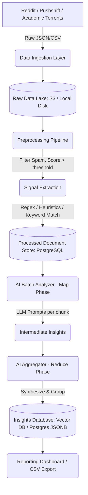

# Reddit AI Problem Discovery System Architecture

## 1. System Overview
The goal of this system is to ingest massive amounts of Reddit data (posts and comments), filter out noise, and use Large Language Models (LLMs) to identify real-world problems, repeated complaints, and potential startup opportunities. 

The system operates in a batch-processing fashion, utilizing a Map-Reduce style hierarchical summarization approach to overcome LLM context window limits and synthesize broad insights.

## 2. Architecture Diagram

## 3. Technology Recommendations

### 3.1 Data Collection
- **Source**: Pushshift archives (Academic Torrents) or official Reddit Data Dumps (e.g., via Google BigQuery/Kaggle). Using the Reddit API (PRAW/AsyncPRAW) is only recommended for real-time tracking or small updates, as the API has strict rate limits.
- **Tools**: `zstandard` (zst) stream parsers for Pushshift dumps.

### 3.2 Data Storage
- **Document Store**: **PostgreSQL** (using `JSONB` for flexible schema). 
  *Why?* Postgres is heavily optimized, supports full-text search, handles millions of rows effortlessly, and with JSONB, we can iterate on the metadata schema without constant migrations.
- **Vector Database**: **Qdrant** or **Pinecone** (Optional, but highly recommended for the next phase).
  *Why?* Once problems are extracted, converting them to embeddings allows us to group similar complaints across different batches easily using cosine similarity.

### 3.3 AI Model & Pipeline
- **AI Model**: OpenAI `gpt-4o-mini` or Anthropic `claude-3-haiku` for the "Map" phase (high volume, cheap, fast). `gpt-4o` or `claude-3.5-sonnet` for the "Reduce" phase (deep synthesis).
- **Control Flow**: Python with `asyncio` for parallel API calls, or a workflow engine like **Prefect** / **Temporal** for robust retry logic and checkpointing.

## 4. Component Explanations

### 4.1 Ingestion Layer
Downloads bulk data. For this MVP, we simulate bulk ingestion using local JSON files or Pushshift API streams. It standardizes the data to a common schema: `id`, `text`, `author`, `score`, `timestamp`, `subreddit`.

### 4.2 Preprocessing & Filtering
Most Reddit data is noise. We use heuristic filtering:
1. **Length**: Discard overly short (< 10 words) or exceptionally long rants.
2. **Quality**: Require a minimum upvote threshold (e.g., > 2) to ensure the problem resonates with others.
3. **Regex/Signal**: Filter for "need statements" (`I wish`, `How do you`, `Is there a tool`, `I hate when`, `Struggling with`).

### 4.3 AI Analysis (Map-Reduce)
- **Map Phase**: Chunks filtered posts into batches (e.g., 50 posts per batch). Sends them to an LLM to extract structured problems (Problem, Frequency in batch, Evidence quotes).
- **Reduce Phase**: Takes the outputs of all Map phases and prompts a smarter LLM to merge duplicates, aggregate frequencies, and generate actionable "Startup Ideas".

## 5. Scaling and Optimization

1. **Vector Search & Embedding Clustering**: Instead of just using LLMs to group similar problems, generate an embedding for each extracted problem statement. Use a clustering algorithm like HDBSCAN to automatically find dense clusters of similar complaints without relying on pure prompt-based reduction.
2. **Distributed Processing**: Use Apache Spark or Ray for distributed processing of the massive Pushshift `.zst` files.
3. **Automated Trend Detection**: Run the pipeline chronologically and track the velocity of specific problem clusters over time to detect emerging trends early.
